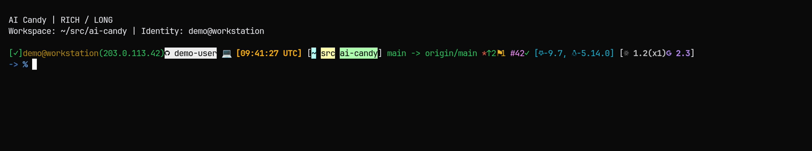

# AI Candy



A responsive Oh My Zsh theme for developers who move between macOS, Linux,
containers, virtual machines, and remote hosts.

Author: Sihao Liu <sihao@cs.ucla.edu>

## Features

- Adaptive long, short, and minimal layouts based on terminal width
- Git branch, dirty state, ahead/behind counts, stash count, and operation state
- GitHub username, pull request, and CI status integration
- Public IPv4 and SSH session indicators
- macOS and Linux distribution/kernel information
- Installed version and running-instance status for supported coding tools
- Emoji and plain-text modes
- Session-memory hot caches with optional cross-session persistence
- Bounded local and network probes with portable Zsh timeout support
- Atomic cache writes, descriptor locks, restrictive permissions, and bounded cleanup

The theme uses Oh My Zsh's asynchronous prompt API for Git status when that API
is available and enabled. Its synchronous fallback obtains the changing Git facts
from one porcelain-v2 status snapshot per render.
If a repository status snapshot exceeds its deadline or output bound, the theme
still displays the branch from Git metadata and briefly backs off before trying
the full status again.
Repository-level `oh-my-zsh.hide-info` and `oh-my-zsh.hide-dirty` settings are
honored, including exact tag names for detached commits.

## Compatibility

The supported environments are:

- macOS with Zsh 5.4.2 or newer
- Red Hat Enterprise Linux-compatible releases 9 and 10
- Ubuntu 22.04 and 24.04

The version of Bash shipped by macOS does not affect this theme. Oh My Zsh
themes execute in Zsh, and the runtime code does not invoke Bash.

Continuous integration exercises Ubuntu 22.04/24.04, AlmaLinux 9/10, and
macOS runners. A pinned Zsh 5.4.2 image checks the minimum supported shell. The
macOS runner exercises the BSD userland, while runtime tests also cover fallback
paths that do not depend on GNU coreutils.

## Installation

Install the theme with one command:

```sh
sh -c 'installer_url="https://raw.githubusercontent.com/SihaoLiu/ai-candy/refs/heads/main/install.sh"; installer_max_bytes=262144; installer_limit_blocks=$(( (installer_max_bytes + 511) / 512 )); installer=$(mktemp) && (ulimit -f "$installer_limit_blocks" && exec curl -fsSL --proto "=https" --proto-redir "=https" --connect-timeout 5 --max-time 30 --max-filesize "$installer_max_bytes" -o "$installer" -- "$installer_url") && installer_size=$(LC_ALL=C wc -c < "$installer") && [ "$installer_size" -gt 0 ] && [ "$installer_size" -le "$installer_max_bytes" ] && sh "$installer" "$@"; status=$?; rm -f "${installer:-}"; exit "$status"' sh
```

The installer requires an existing Oh My Zsh installation. It validates the
downloaded standalone theme with Zsh before atomically publishing it below the
Oh My Zsh custom theme directory. Downloads are restricted to HTTPS, bounded to
1 MiB, and have finite connection and total deadlines. An identical installed
theme is not replaced or backed up, although unsafe group or other write
permissions are removed. An upgrade preserves the previous file beside the new
theme.
Existing `.zshrc` files, including symbolic links, are never rewritten; the
installer prints the exact setting to change manually. If `.zshrc` does not
exist, the installer creates it from the installed Oh My Zsh template and
selects `ai-candy` there.

`AI_CANDY_THEME_URL` may be exported before running the installer to use a
self-hosted HTTPS mirror of the standalone theme. Leave it unset for the
standard GitHub-hosted installation.
The one-line command follows the Oh My Zsh installer trust model and fetches
the current `main` branch. For a reproducible installation, inspect the script
and replace both raw URLs with URLs pinned to a reviewed tag or commit.

To prevent the installer from creating a missing `.zshrc`:

```sh
sh -c 'installer_url="https://raw.githubusercontent.com/SihaoLiu/ai-candy/refs/heads/main/install.sh"; installer_max_bytes=262144; installer_limit_blocks=$(( (installer_max_bytes + 511) / 512 )); installer=$(mktemp) && (ulimit -f "$installer_limit_blocks" && exec curl -fsSL --proto "=https" --proto-redir "=https" --connect-timeout 5 --max-time 30 --max-filesize "$installer_max_bytes" -o "$installer" -- "$installer_url") && installer_size=$(LC_ALL=C wc -c < "$installer") && [ "$installer_size" -gt 0 ] && [ "$installer_size" -le "$installer_max_bytes" ] && sh "$installer" "$@"; status=$?; rm -f "${installer:-}"; exit "$status"' sh --no-modify-zshrc
```

For a manual installation, clone the repository or download the standalone
theme, then copy it into the custom theme directory:

```sh
cp ai-candy.zsh-theme "${ZSH_CUSTOM:-$HOME/.oh-my-zsh/custom}/themes/"
```

Select it in `~/.zshrc`:

```sh
ZSH_THEME="ai-candy"
```

Start a new Zsh session or reload the configuration:

```sh
source ~/.zshrc
```

## Uninstallation

Select a different `ZSH_THEME` in `~/.zshrc`, then remove the installed theme:

```sh
rm "${ZSH_CUSTOM:-$HOME/.oh-my-zsh/custom}/themes/ai-candy.zsh-theme"
```

Upgrades keep prior theme files as `ai-candy.zsh-theme.backup.*`. They are not
removed automatically because they may be needed for recovery. List and review
them before deleting any that are no longer needed:

```sh
find "${ZSH_CUSTOM:-$HOME/.oh-my-zsh/custom}/themes" \
  -type f -name 'ai-candy.zsh-theme.backup.*' -print
```

## Requirements

Required:

- Zsh 5.4.2 or newer
- The standard `zsh/datetime` module
- Oh My Zsh
- A terminal with 256-color support
- A Nerd Font when emoji mode is enabled

Optional integrations:

- `git` with porcelain-v2 and `--show-stash` support for repository status and
  path hierarchy; the versions shipped by all supported targets satisfy this
- `sqlite3` for the persistent cache backend
- `curl` for public IP and tool update checks
- `gh` for GitHub identity, pull request, and CI status
- `ssh` for GitHub SSH identity detection
- Supported coding-tool CLIs for their version badges

GNU `timeout`, `gtimeout`, `flock`, and `xxd` are not required. The theme uses
standard Zsh modules for timeouts, locking, file operations, and cache encoding.
GNU `timeout` or `gtimeout` remains a fallback for Zsh builds that omit
`zsh/system` or `zsh/zselect`.

## Quick Commands

Short aliases are disabled by default. Enable them before Oh My Zsh loads the
theme:

```zsh
AI_CANDY_ENABLE_SHORT_ALIASES=1
```

When enabled, the theme creates these aliases only when the name is not already
an alias or function:

| Command | Action |
|---|---|
| `e` | Toggle emoji and plain-text modes |
| `p` | Toggle space and slash path separators |
| `n` | Toggle all network-backed features |
| `a` | Toggle coding-tool badges |
| `o` | Toggle OS and kernel information |
| `off` | Disable optional display and network modes |
| `on` | Enable optional display and network modes |
| `t` | Show integration and cache status |
| `u` | Clear derived caches and re-detect commands |
| `h` | Show the built-in badge reference |

To disable asynchronous Git through the same Oh My Zsh setting used by its Git
library:

```zsh
zstyle ':omz:alpha:lib:git' async-prompt no
```

This opt-out favors immediately fresh Git state and runs one bounded
porcelain-v2 status probe per prompt. Keep asynchronous Git enabled for the
lowest latency in large working trees.

## Cache Design

The parent Zsh process owns the hot key-value cache for Git and pull-request
data. Small permission-restricted result files carry topology generations,
public IP data, GitHub identities, and tool versions from background workers
back to the parent shell. Prompt renders read those local files without running
network commands. On a cold key-value miss, the prompt may attempt one
non-waiting persistent lookup with a 50 ms I/O deadline. A cache mutation
reserves its key with a small metadata update whose lock wait is capped at 20 ms;
the backend write remains in a registered background worker.

SQLite or a portable line-file backend provides a cold, cross-session cache.
The persistent backend is initialized only on its first use. The first backend
selection is recorded in `persistent_backend`; every live shell revalidates that
owner instead of silently falling back to a different format. This prevents
SQLite and line-file writers from becoming competing authorities. The `u`
command clears the derived backend state and lets the next access select again.

Both backends use the same validated expiration rules. Parent-shell memory
updates are immediate. File updates use atomic same-directory renames and Zsh
descriptor locks, with a conservative directory-lock fallback for builds
lacking `zsh/system`. Cross-shell reservations use persistent, epoch-scoped
monotonic tokens rather than wall-clock time, so clock corrections cannot
reverse cache operation order. A versioned persistence epoch prevents a background task
started in another shell from restoring stale data after `u`. SQLite is
therefore optional persistence, not a requirement for a fast warm prompt.
If the operation journal reaches its configured bound, a new persistence
reservation is skipped rather than evicting an active reservation.

Cache data is stored below:

```text
${XDG_CACHE_HOME:-$HOME/.cache}/zsh-prompt
```

The final cache directory must not be a symbolic link. Its mode is restricted
to `0700`; regular cache files and the SQLite database use `0600`. Remote URLs
are hashed before they become persistent pull-request cache keys. Theme-owned
files are size-checked and symbolic links are not read. The line backend and
operation journal are limited to 256 KiB, 500 records, and 32 KiB per record;
malformed records fail closed. Cleanup is bounded and runs periodically rather
than during theme startup. Native timeout capture files live in this private
directory when available and are limited to 256 KiB.

## Network And Privacy

Network mode is enabled by default. When short aliases are enabled, `n` toggles
it. Disabling network mode prevents the theme from starting public IP, GitHub,
and update-check requests.

When enabled, the theme may contact:

- `checkip.amazonaws.com`, `ifconfig.me`, `icanhazip.com`, or `api.ipify.org`
  to determine the public IPv4 address
- GitHub through `gh` and `ssh`
- the public release endpoints for installed coding tools

These services receive the network metadata inherent to an outbound request.
The theme does not read or persist authentication tokens. Authentication remains
inside the installed `gh` and `ssh` clients. Local caches can contain derived
information such as repository paths, public IP addresses, usernames, and tool
versions, and are protected by the cache-directory permissions described above.

No runtime cache or machine-local scratch data belongs in the repository.
Automated tests reject common private-key markers, access-token prefixes, and
absolute macOS/Linux home-directory paths in public text files.

## Layout

The prompt chooses among three layouts:

```text
LONG   Full path, system information, and tool status on the left
SHORT  Compact system information and optional tool status on the right
MIN    Truncated path with compact right-prompt information
```

Git special-state indicators cover rebase, merge, cherry-pick, revert, bisect,
and detached HEAD. The prompt also shows background job count, command status,
virtual environment, session type, and time zone.

## Development

Files under `src/` are the maintainable source of truth. The root
`ai-candy.zsh-theme` file is the generated standalone distribution used by Oh My
Zsh installations.

Regenerate or verify the distribution:

```sh
zsh scripts/build-theme.zsh
zsh scripts/build-theme.zsh --check
```

Regenerate the animated terminal demo:

```sh
zsh scripts/generate-demo.zsh
```

Install VHS without `sudo` when Go is available:

```sh
GOBIN="$HOME/.local/bin" go install github.com/charmbracelet/vhs@v0.11.0
export PATH="$HOME/.local/bin:$PATH"
```

The generator uses a local VHS installation when `vhs`, `ttyd`, and `ffmpeg`
are available. Otherwise it uses the pinned official VHS container through
Docker, which requires no system-wide installation. The Go command above
installs VHS itself; local rendering still requires `ttyd` and `ffmpeg`.

Both paths use a fresh synthetic fixture, an empty synthetic home, a minimal
environment, and the theme's network mode disabled. The Docker renderer mounts
only the read-only tape and the fresh render directory, never the repository or
preexisting scratch contents, and runs with container networking disabled. A
local VHS process is a trusted host process and retains normal host filesystem
and network access. The fresh render directory is removed after generation.
`demo.gif` and the static `demo.png` frame are published only after text and
binary privacy checks pass; generation fails closed when `strings` is missing.
`demo-assets.sha256` records the reviewed output. Any digest change should come
from this generator and include a visual review of both assets; binary scanning
only checks metadata and cannot inspect text rendered into compressed pixels.

Run the test suite:

```sh
python3 -m unittest discover -s tests -v
```

The tests cover cache concurrency and corruption, malformed timestamps, signal
cleanup, process deadlines, Git cache invalidation, prompt escaping, symlink
handling, startup behavior, and hot-path process counts.

## License

MIT License. See [LICENSE](LICENSE).
