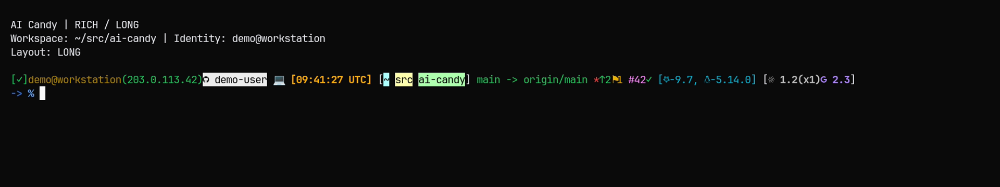

# AI Candy



**A responsive Oh My Zsh theme for the AI-assisted developer who works across containers, VMs, and bare metal.**

*Author: Sihao Liu <sihao@cs.ucla.edu>*

Ever SSH'd into a machine and wondered *"Wait, am I on the host or in a container?"* — This theme has your back.

## Features

- **Responsive Layout** — Adapts to terminal width and uses RPROMPT for sysinfo/AI in tight spaces
- **Environment Detection** — Instantly know if you're in a container, TTY, or specific Desktop Environment (GNOME, KDE, XFCE, Xorg)
- **OS & Kernel Info** — Displays distro-specific icons (Red Hat, Ubuntu, Fedora, etc.) and kernel type
- **SSH + Public IP** — SSH indicator plus external IP (green) or `(offline)` (red)
- **Git Status** — Branch, dirty marker, ahead/behind, stash count, and special states (rebase, merge, cherry-pick, revert, bisect)
- **GitHub Integration** — Username badge (with mismatch detection) + PR number + CI status
- **AI Tools Status** — Claude, Codex, Gemini, and Kimi versions with update indicators
- **Toggle Modes** — Emoji/plaintext, path separator (space/slash), and network on/off
- **Smart Caching** — Multi-tier memory + SQLite (WAL mode) + file caches with background refresh, zero prompt lag
- **Secure** — Cache files are created with `umask 077` and stored in a secure directory

## Demo

Watch the prompt gracefully adapt as your terminal shrinks. Short/min modes push system info + AI to RPROMPT (right side):

**Emoji Mode (Requires Nerd Font):**
```
# LONG MODE - Full details + AI tools + PR status
[✓]user@host(x.x.x.x)  GitHubUser 💻 [09:32:49 PDT] [~/project] [main][#42✓] [  RHEL 9.7,  Linux-5.14.0] [ 1.0.18| 0.1.2504302| 0.1.9*| 0.28.1]
-> %

# SHORT MODE - Sysinfo + AI move to RPROMPT
[✓]user@host(x.x.x.x)  GitHubUser 💻 [09:32:53 PDT] [~/project] [main][#42✓]
# RPROMPT: [  Rhel-9.7,  Linux-5.14.0] [ 1.0.18| 0.1.2504302| 0.1.9*| 0.28.1]
-> %

# MIN MODE - Truncated path
[✓]user@host(x.x.x.x)  GitHubUser 💻 [09:33:11 PDT] [~/proj/..] [main]
# RPROMPT: [  Rhel-9.7,  Linux-5.14.0]
-> %
```

**Plaintext Mode:**
```
# LONG MODE with long AI names
[OK][SSH]user@host(x.x.x.x)[GitHubUser] H [09:32:49 PDT] [~/project] [main][#42 OK] [Red Hat Enterprise Linux 9.7 (Plow), Linux-5.14.0] [Claude:1.0.18|Codex:0.1.2504302|Gemini:0.1.9*|Kimi:0.28.1]

# LONG MODE with short AI names
[OK][SSH]user@host(x.x.x.x)[GitHubUser] H [09:32:49 PDT] [~/project] [main][#42 OK] [Red Hat Enterprise Linux 9.7 (Plow), Linux-5.14.0] [Cl:1.0.18|Cx:0.1.2504302|Gm:0.1.9*|Km:0.28.1]
```

## Badge Reference

### Command Status

| Indicator | Meaning |
|-----------|---------|
| `[✓]` / `[OK]` | Last command succeeded (exit code 0) |
| `[✗N]` / `[ERRN]` | Last command failed with exit code N |

### Connection & Environment

| Indicator | Meaning |
|-----------|---------|
| `󰣀` / `[SSH]` | Connected via SSH (Nerd Font: nf-md-ssh) |
| `(x.x.x.x)` | Public IP address (green) |
| `(offline)` | No external connectivity (red) |

### GitHub Identity

| Indicator | Meaning |
|-----------|---------|
| ` Username` / `[User]` | GitHub username badge (white bg) |
| ` A|B` / `[A|B]` (red) | Mismatch between `gh` and SSH identities |

### AI Tools

| Badge | Tool | Color |
|-------|------|-------|
| ` ` / `Cl:` / `Claude:` | Claude Code (Nerd Font: nf-fa-asterisk) | Coral |
| ` ` / `Cx:` / `Codex:` | OpenAI Codex CLI (Nerd Font: nf-fae-atom) | Light Gray |
| ` ` / `Gm:` / `Gemini:` | Gemini CLI (Nerd Font: nf-fa-google) | Purple |
| ` ` / `Km:` / `Kimi:` | Moonshot Kimi CLI (Nerd Font: nf-fa-moon_o) | Sky Blue |

A red `*` after the version means an update is available.

### Host & Environment Badges

| Indicator | Meaning | Color |
|-----------|---------|-------|
| ` ` / `C` | Inside a container (Nerd Font: nf-fa-docker) | Magenta |
| ` ` / `T` | TTY session (Nerd Font: nf-fa-tty) | Yellow |
| ` ` / `G` | GNOME Desktop (Nerd Font: nf-linux-gnome) | Yellow |
| ` ` / `K` | KDE Plasma (Nerd Font: nf-linux-kde_plasma) | Yellow |
| ` ` / `X` | XFCE Desktop (Nerd Font: nf-linux-xfce) | Yellow |
| ` ` / `O` | Xorg Session (Nerd Font: nf-linux-xorg) | Yellow |
| `💻` / `H` | Physical/VM host | Yellow |

### GitHub PR Status

| Indicator | Meaning |
|-----------|---------|
| `#N` | Pull request number N for current branch |
| `✓` / `OK` | All CI checks passed |
| `✗` / `X` | Some CI checks failed |
| `⏳` / `...` | CI checks still running |

### Git Extended Status

| Indicator | Meaning |
|-----------|---------|
| `↑N` / `+N` | N commits ahead of upstream |
| `↓N` / `-N` | N commits behind upstream |
| `⚑N` / `SN` | N stashed changes |
| `*` | Uncommitted changes |

### Git Special States

| Indicator | Meaning |
|-----------|---------|
| `🔀` / `RB` | Rebase in progress |
| `🔀` / `MG` | Merge in progress |
| `🍒` / `CP` | Cherry-pick in progress |
| `⏪` / `RV` | Revert in progress |
| `🔍` / `BI` | Bisect in progress |
| `🔌` / `DT` | Detached HEAD state |

### Other Indicators

| Indicator | Meaning |
|-----------|---------|
| `⚙N` / `JN` | N background jobs running |
| `..` | Path truncated (in narrow terminal) |

## Quick Commands

| Command | Action |
|---------|--------|
| `e` | Toggle emoji/plaintext mode |
| `p` | Toggle path separator (space/slash) |
| `n` | Toggle network features (IP, GitHub, AI updates) |
| `t` | Show tool availability status |
| `u` | Refresh all cached prompt info |
| `h` | Show help |

## Installation

### Using Oh My Zsh

1. Clone this repo or download `ai-candy.zsh-theme`
2. Copy the theme to your Oh My Zsh themes directory:
   ```bash
   cp ai-candy.zsh-theme ~/.oh-my-zsh/custom/themes/
   ```
3. Set it in your `~/.zshrc`:
   ```bash
   ZSH_THEME="ai-candy"
   ```
4. Reload your shell:
   ```bash
   source ~/.zshrc
   ```

## Requirements

- Zsh 5.4+ (nameref support)
- [Oh My Zsh](https://ohmyz.sh/)
- A terminal with 256-color support
- **A [Nerd Font](https://www.nerdfonts.com/)** (Required for Emoji Mode icons)
- Optional: `sqlite3` and `xxd` (for faster caching)
- Optional: `timeout`/`gtimeout` (coreutils) for network features
- Optional: `curl` for public IP display and AI update checks
- Optional: `gh` CLI for GitHub PR status badge
- Optional: `ssh` for GitHub identity badge
- Optional: `claude`, `codex`, `gemini`, and/or `kimi` CLI tools for AI status badges

## How It Works

The theme calculates the visible length of all prompt components and picks the best layout for your terminal width:

```
LONG  → Full OS name + full kernel + AI tools on the left
SHORT → Compact OS + kernel + AI tools move to RPROMPT
MIN   → Truncated path + compact sysinfo/AI on RPROMPT
```

Network lookups (public IP, GitHub identity/PR, AI update checks) run in the background and cache results. The theme uses a three-tier caching system (Memory, SQLite, and File) to ensure zero prompt lag.

## Why "AI Candy"?

Because knowing where you are—and what AI tools are at your fingertips—should be sweet, not stressful.

---

*Built for developers who live in terminals and talk to AI.*

## License

MIT License - see [LICENSE](LICENSE) for details.